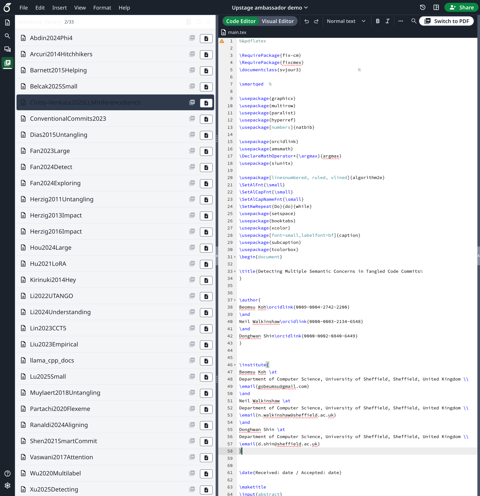

# My Awesome RA

> **AI Agent for Reference-Grounded LaTeX Paper Writing**
> Powered by [Upstage SOLAR API](https://console.upstage.ai/)

논문 작성 시 현재 문단에 맞는 참고문헌 근거를 자동으로 찾아주는 Evidence Panel을 Overleaf CE에 통합한 MVP 프로젝트입니다.

## Demo



## Features

| Feature | Description | Status |
|---------|-------------|--------|
| **Reference Library** | .bib 파일 기반 참고문헌 목록 관리 | ✅ 완료 |
| **PDF Upload & Index** | PDF 업로드 → SOLAR 파싱 → FAISS 인덱싱 | ✅ 완료 |
| **Evidence Search** | 현재 문단 기반 관련 근거 자동 검색 | ✅ 완료 |
| **Overleaf Integration** | Rail Panel로 통합된 UI | ✅ 완료 |

## Architecture

```
┌─────────────────────────────────────────────────────────────┐
│                        Overleaf CE                          │
│  ┌──────────────────┐    ┌────────────────────────────┐    │
│  │   LaTeX Editor   │    │    References Panel        │    │
│  │  (CodeMirror)    │───▶│  - .bib 파일 파싱          │    │
│  │                  │    │  - PDF 업로드/인덱싱       │    │
│  └──────────────────┘    │  - Evidence 검색           │    │
│                          └────────────────────────────┘    │
└─────────────────────────────────────────────────────────────┘
                               │
                               ▼
┌─────────────────────────────────────────────────────────────┐
│                    FastAPI Backend                          │
│  ┌──────────────┐  ┌──────────────┐  ┌──────────────┐      │
│  │   /evidence  │  │  /documents  │  │  /citations  │      │
│  │    /search   │  │   /upload    │  │   /extract   │      │
│  └──────┬───────┘  └──────┬───────┘  └──────┬───────┘      │
│         │                 │                 │               │
│         ▼                 ▼                 ▼               │
│  ┌─────────────────────────────────────────────────────┐   │
│  │              Upstage SOLAR API                      │   │
│  │  • Embedding (solar-embedding-1-large)              │   │
│  │  • Document Parse                                   │   │
│  └─────────────────────────────────────────────────────┘   │
│         │                                                   │
│         ▼                                                   │
│  ┌──────────────┐                                          │
│  │ FAISS Index  │  (1024-dim vectors)                      │
│  └──────────────┘                                          │
└─────────────────────────────────────────────────────────────┘
```

## Quick Start

### Prerequisites
- Python 3.11+
- [uv](https://docs.astral.sh/uv/) (패키지 매니저)
- Docker & Docker Compose
- [Upstage API Key](https://console.upstage.ai/)

### 1. Setup

```bash
# Clone
git clone --recursive https://github.com/GoBeromsu/my-awesome-ra.git
cd my-awesome-ra

# Environment
cp .env.example .env
# .env 파일에 UPSTAGE_API_KEY 설정

# Install dependencies
cd apps/api && uv sync
```

### 2. Run Overleaf (with Evidence Panel)

```bash
# Build & Start
cd overleaf/develop
bin/build
bin/dev web webpack

# Access: http://localhost:80
# Login: demo@example.com / Demo@2024!Secure
```

### 3. Run API Server

```bash
cd apps/api
uv run uvicorn src.main:app --reload --port 8080
```

## Upstage SOLAR API 활용

### 1. Embedding API
```python
# 문단/청크 임베딩 생성 (1024차원)
embedding = await embedding_service.embed_query("The transformer architecture...")
```

### 2. Document Parse API
```python
# PDF에서 텍스트 + 위치 정보 추출
result = await solar_service.parse_document(pdf_bytes, "paper.pdf")
# → {"pages": 10, "content": "...", "grounding": {...}}
```

## API Endpoints

| Method | Endpoint | Description |
|--------|----------|-------------|
| `GET` | `/health` | Health check |
| `GET` | `/documents` | List indexed documents |
| `POST` | `/documents/upload` | Upload & index PDF |
| `POST` | `/documents/{id}/reindex` | Re-index document |
| `DELETE` | `/documents/{id}` | Remove from index |
| `GET` | `/documents/{id}/file` | Serve PDF file |
| `POST` | `/evidence/search` | Search evidence by query |

## Project Structure

```
my-awesome-ra/
├── apps/api/                      # FastAPI Backend
│   └── src/
│       ├── routers/               # API endpoints
│       ├── services/              # SOLAR, FAISS, Embedding
│       └── models/                # Pydantic schemas
│
├── overleaf/                      # Forked Overleaf CE (submodule)
│   └── services/web/modules/
│       └── evidence-panel/        # Evidence Panel Module
│           ├── frontend/js/
│           │   ├── components/    # React UI
│           │   ├── context/       # State management
│           │   └── hooks/         # Custom hooks
│           └── stylesheets/
│
├── fixtures/
│   ├── papers/                    # Sample PDFs
│   └── seed/                      # Pre-built FAISS index
│
└── scripts/
    └── index_fixtures.py          # Seed data indexer
```

## Tech Stack

| Layer | Technology |
|-------|------------|
| **AI/ML** | Upstage SOLAR (Embedding, Document Parse) |
| **Backend** | FastAPI, FAISS, Python 3.11 |
| **Frontend** | React 18, TypeScript, CodeMirror 6 |
| **Editor** | Overleaf Community Edition |
| **Infra** | Docker, uv |

## License

AGPL-3.0 (Overleaf CE 호환)

---

Built with [Upstage SOLAR API](https://console.upstage.ai/) | [GoBeromsu](https://github.com/GoBeromsu)
