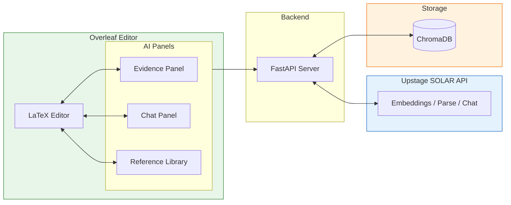
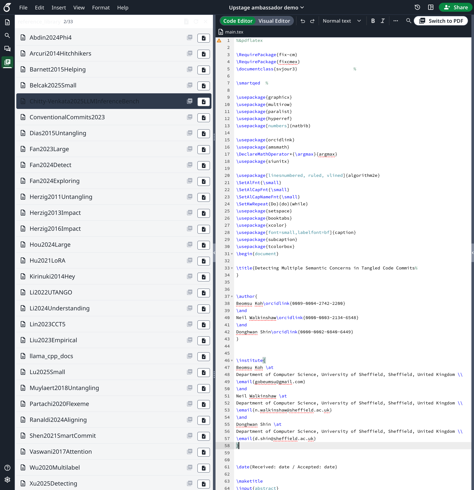
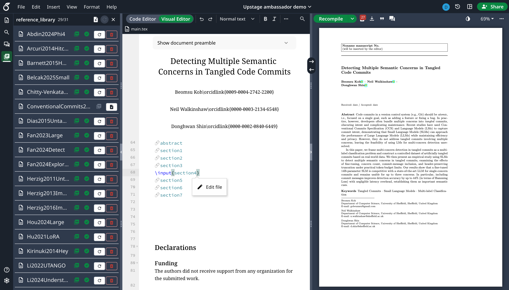
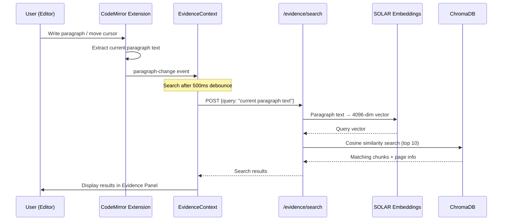
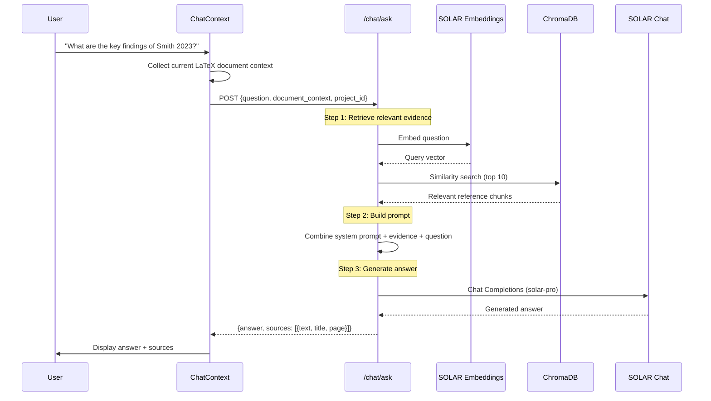
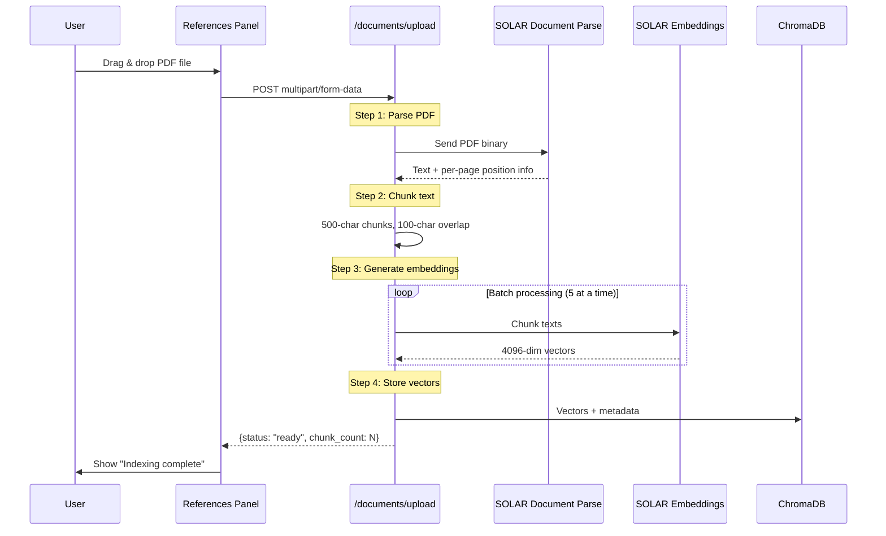

# My Awesome RA

> **AI Research Assistant for LaTeX paper writing — built on [Upstage SOLAR API](https://console.upstage.ai/)**

Writing a paper means constantly switching between your editor and your references to find evidence. **My Awesome RA** eliminates that context switch: it surfaces relevant citations *as you write*, answers questions about your references, and manages your PDF library — all inside the Overleaf editor.

Built by forking [Overleaf Community Edition](https://github.com/overleaf/overleaf) and integrating a FastAPI backend with Upstage SOLAR's embedding, document parse, and chat APIs.

## Tech Stack

| Layer     | Technology                                      |
| --------- | ----------------------------------------------- |
| AI        | Upstage SOLAR (Embeddings, Document Parse, Chat) |
| Backend   | FastAPI, ChromaDB                               |
| Frontend  | React, TypeScript, CodeMirror 6                 |
| Editor    | Overleaf CE (forked)                            |
| Infra     | Docker Compose                                  |

## System Overview


```mermaid
flowchart LR
    subgraph Overleaf["Overleaf Editor"]
        Editor["LaTeX Editor"]
        subgraph Panels["AI Panels"]
            Evidence["Evidence Panel"]
            Chat["Chat Panel"]
            RefLib["Reference Library"]
        end
    end

    subgraph Backend["Backend"]
        API["FastAPI Server"]
    end

    subgraph Upstage["Upstage SOLAR API"]
        Solar["Embeddings / Parse / Chat"]
    end

    subgraph Storage["Storage"]
        Chroma[("ChromaDB")]
    end

    Editor <--> Evidence & Chat & RefLib
    Panels --> API
    API <--> Solar
    API <--> Chroma

    style Overleaf fill:#e8f5e9,stroke:#2e7d32
    style Upstage fill:#e3f2fd,stroke:#1565c0
    style Storage fill:#fff3e0,stroke:#ef6c00
```

| Panel | Trigger | Upstage API | Output |
|-------|---------|-------------|--------|
| **Evidence Panel** | Paragraph change | Embeddings → similarity search | Related evidence + page numbers |
| **Chat Panel** | User question | Embeddings + Chat | RAG answer + sources |
| **Reference Library** | PDF upload | Document Parse | Vectorized index |

### Upstage API Endpoints

Base URL: `https://api.upstage.ai`

| API | Endpoint | Purpose |
|-----|----------|---------|
| **Embeddings** | `/v1/solar/embeddings` | Text vectorization (query & document embeddings) |
| **Document Parse** | `/v1/document-ai/document-parse` | PDF parsing (text extraction + page position info) |
| **Chat Completions** | `/v1/solar/chat/completions` | RAG-based conversational answer generation |

## Demo

### Evidence Panel


### Chat Panel


### Reference Library


## Features

| Feature | Description |
|---------|-------------|
| **Evidence Search** | Auto-search on paragraph change (500ms debounce) + manual search |
| **Chat Panel** | RAG Q&A grounded in your reference PDFs |
| **PDF Upload & Indexing** | PDF → SOLAR Document Parse → ChromaDB indexing |
| **Reference Library** | PDF-based reference management with optional cite key linking |

## How Each Panel Works

### Evidence Panel

**Auto search:** Write a paragraph → 500ms debounce → automatic search → click to cite
**Manual search:** Type a query directly → click Search

Answers *"What's the evidence for this claim?"* without leaving the editor. As you write, relevant chunks with page numbers appear in the panel for preview.


```mermaid
sequenceDiagram
    participant User as User (Editor)
    participant Ext as CodeMirror Extension
    participant Ctx as EvidenceContext
    participant API as /evidence/search
    participant Solar as SOLAR Embeddings
    participant DB as ChromaDB

    User->>Ext: Write paragraph / move cursor
    Ext->>Ext: Extract current paragraph text
    Ext->>Ctx: paragraph-change event

    Note over Ctx: Search after 500ms debounce

    Ctx->>API: POST {query: "current paragraph text"}
    API->>Solar: Paragraph text → 4096-dim vector
    Solar-->>API: Query vector
    API->>DB: Cosine similarity search (top 10)
    DB-->>API: Matching chunks + page info
    API-->>Ctx: Search results
    Ctx->>User: Display results in Evidence Panel
```

### Chat Panel

Ask a question → retrieve relevant evidence → AI answer with sources

Answers *"What was the methodology in this reference?"* grounded in your PDFs. Every answer includes source citations (chunk + page) so you can verify.


```mermaid
sequenceDiagram
    participant User
    participant Chat as ChatContext
    participant API as /chat/ask
    participant Embed as SOLAR Embeddings
    participant DB as ChromaDB
    participant LLM as SOLAR Chat

    User->>Chat: "What are the key findings of Smith 2023?"
    Chat->>Chat: Collect current LaTeX document context

    Chat->>API: POST {question, document_context, project_id}

    Note over API: Step 1: Retrieve relevant evidence
    API->>Embed: Embed question
    Embed-->>API: Query vector
    API->>DB: Similarity search (top 10)
    DB-->>API: Relevant reference chunks

    Note over API: Step 2: Build prompt
    API->>API: Combine system prompt + evidence + question

    Note over API: Step 3: Generate answer
    API->>LLM: Chat Completions (solar-pro)
    LLM-->>API: Generated answer

    API-->>Chat: {answer, sources: [{text, title, page}]}
    Chat->>User: Display answer + sources
```

### Reference Library

Upload PDF → auto-parse → immediately searchable

Upload a new reference PDF and it becomes searchable right away — no manual indexing step.


```mermaid
sequenceDiagram
    participant User
    participant UI as References Panel
    participant API as /documents/upload
    participant Parse as SOLAR Document Parse
    participant Embed as SOLAR Embeddings
    participant DB as ChromaDB

    User->>UI: Drag & drop PDF file
    UI->>API: POST multipart/form-data

    Note over API: Step 1: Parse PDF
    API->>Parse: Send PDF binary
    Parse-->>API: Text + per-page position info

    Note over API: Step 2: Chunk text
    API->>API: 500-char chunks, 100-char overlap

    Note over API: Step 3: Generate embeddings
    loop Batch processing (5 at a time)
        API->>Embed: Chunk texts
        Embed-->>API: 4096-dim vectors
    end

    Note over API: Step 4: Store vectors
    API->>DB: Vectors + metadata

    API-->>UI: {status: "ready", chunk_count: N}
    UI->>User: Show "Indexing complete"
```

### Evidence Panel vs Chat Panel

| | Evidence Panel | Chat Panel |
|--|----------------|------------|
| **Trigger** | Paragraph event (auto) / search box (manual) | User question (manual) |
| **Purpose** | Quickly surface evidence candidates → insert citation | Summarize / explain / compare based on evidence |
| **Output** | Evidence list (snippet + page) | Answer + sources |

Both panels share the same index (reference PDFs → chunked → embedded → Vector DB).

## Quick Start

### Prerequisites

- Docker & Docker Compose
- [Upstage API Key](https://console.upstage.ai/)

### Demo Mode (Recommended)

Starts Overleaf + RA API + a demo project in a single command (user auto-created).

```bash
git clone --recursive https://github.com/GoBeromsu/my-awesome-ra.git
cd my-awesome-ra

export UPSTAGE_API_KEY=<your_upstage_key>
cd deployment
docker compose --profile demo up -d   # add --build after code changes
# Wait 1-2 minutes; optional: docker compose logs -f demo-init
```

- URL: [http://localhost](http://localhost)
- Login: `demo@example.com` / `Demo@2024!Secure`
- Demo project: **"Upstage ambassador demo"** — pre-loaded with the author's paper [Detecting Multiple Semantic Concerns in Tangled Code Commits](https://arxiv.org/abs/2601.21298) (LaTeX files pre-loaded; fixture image warnings when history service is disabled can be ignored).

Reset to initial state (removes data volumes):

```bash
cd deployment
docker compose down
docker volume rm deployment_overleaf-data deployment_api-data deployment_mongo-data deployment_redis-data
docker compose --profile demo up -d
```

### Development Mode

```bash
# Build CLSI (first time only)
cd overleaf
docker build -f develop/Dockerfile.clsi-dev -t develop-clsi .

# Start development services
cd develop
docker compose up -d mongo redis web webpack clsi filestore docstore document-updater history-v1 real-time

# Initialize MongoDB replica set
docker exec develop-mongo-1 mongosh --quiet --eval "rs.initiate()"

# Set up demo data
CONTAINER_NAME=develop-web-1 ./scripts/setup-demo.sh
```

## API Reference

### Core

| Method | Endpoint | Description |
|--------|----------|-------------|
| `POST` | `/evidence/search` | Query-based evidence retrieval |
| `POST` | `/chat/ask` | RAG question answering |

### Document Management

| Method | Endpoint | Description |
|--------|----------|-------------|
| `GET` | `/documents` | List indexed documents |
| `POST` | `/documents/upload` | Upload and index a PDF |
| `GET` | `/documents/{id}/status` | Check indexing status |
| `GET` | `/documents/{id}/file` | Download original PDF |
| `POST` | `/documents/{id}/reindex` | Re-parse and re-index a document |
| `DELETE` | `/documents/{id}` | Delete a document |

## Project Structure

```text
my-awesome-ra/
├── apps/api/              # FastAPI backend
├── overleaf/              # Forked Overleaf CE
├── deployment/            # Docker Compose configs
├── fixtures/              # Demo data
└── scripts/               # Setup utilities
```

## Configuration

### Required

| Variable | Required | Default | Description |
|----------|:--------:|---------|-------------|
| `UPSTAGE_API_KEY` | ✅ | — | SOLAR API key |

### Demo & Development

| Variable | Default | Description |
|----------|---------|-------------|
| `SEED_INDEX_PATH` | `fixtures/seed` | Initial seed index path |
| `RESET_TO_SEED` | `false` | Reset to seed index on startup |
| `FRONTEND_URL` | — | Frontend URL for CORS |

## License

AGPL-3.0 (compatible with Overleaf CE)
